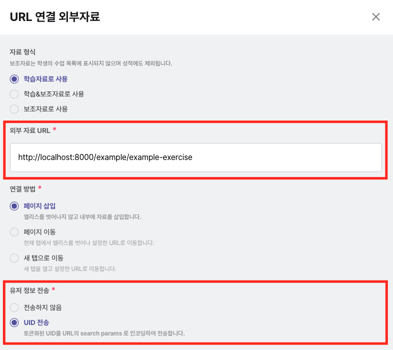
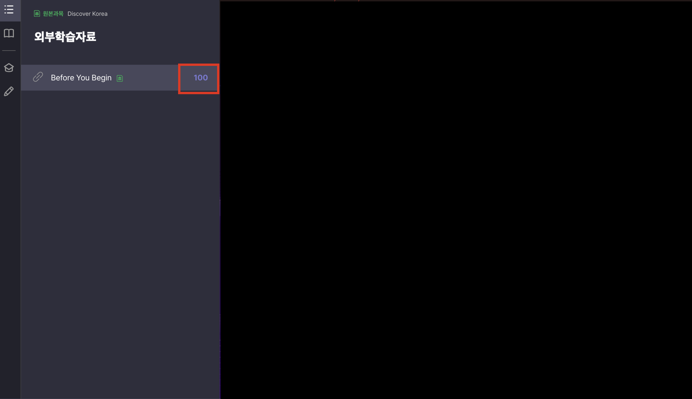

# External Contents Web (외부 학습 자료)

본 문서는 엘리스의 외부 학습 자료를 개발의 가이드라인을 제공합니다.

이외의 다른 질문에 대해서는 엘리스로 연락 주시기 바랍니다.

## 빠른 프로젝트 시작

### 실행 환경

해당 프로젝트를 원활히 동작하기 위하여 다음과 같이 환경을 설정해주세요.

- [nodejs](https://nodejs.org/dist/v20.5.0/) 버전: `~20.5`
- [yarn](https://classic.yarnpkg.com/en/docs) 버전: `>=1.20 <2`

### VSCode 및 권장 플러그인

다른 에디터 IDE를 사용하실 수 있지만, 엘리스에서 설정해 놓은 프로젝트 환경에 맞춰 개발을 위해서 [VSCode](https://code.visualstudio.com/)와 아래 플러그인들을 같이 사용하시는 것을 권장합니다.

- [ESLint](https://marketplace.visualstudio.com/items?itemName=dbaeumer.vscode-eslint)
- [Prettier](https://marketplace.visualstudio.com/items?itemName=esbenp.prettier-vscode)
- [EditorConfig for VS Code](https://marketplace.visualstudio.com/items?itemName=EditorConfig.EditorConfig)

### 개발 환경 실행

명령줄에 아래와 같이 실행하여 프로젝트를 실행할 수 있습니다. (개발 환경 url: http://localhost:8000)

```
$ yarn install
$ yarn start
```

## 프로젝트 구조

프로젝트는 크게 아래와 같은 폴더 구조로 이루어져 있습니다.

```
./
├─ lib          내부 사용 npm 패키지
├─ public       index.html 및 public 에셋
└─ src          
   ├─ contents  ⭐️ 실제 콘텐츠 작업 영역 ⭐️
   └─ elice     프로젝트 코어 로직 및 콘텐츠 제작 도구

```

여기서 콘텐츠 제작자는 **`src/contents` 폴더에서 콘텐츠를 제작**하시면 됩니다.

> **⚠️ 이외의 폴더 내 파일들은 임의로 수정하시면 안되며, 관련하여 질문이 있으시면 연락 주시기 바랍니다.**

```
./src/contents/
├─ math-basic
├─ math-advanced
├─ ...
└─ my-quiz                  콘텐츠 묶음
   ├─ MyQuiz.tsx            콘텐츠 묶음 container
   ├─ MyQuiz.routes.ts      콘텐츠 내부 라우팅
   └─ ...
      ├─ MyQuizFirst.tsx    콘텐츠 01
      ├─ MyQuizSecond.tsx   콘텐츠 02
      └─ ...
```

제작할 콘텐츠 묶음 이름으로 폴더를 생성 후(예시는 `my-quiz` 라는 이름으로 사용), 하위 파일들을 생성하면 됩니다.
기본적으로 템플릿에 포함되어 있는 `src/contents/{example}` 폴더를 `src/contents` 아래에 복제하여 제작할 콘텐츠 이름으로 변경해주시면 더 쉽게 작업하실 수 있습니다.

### `{example}.tsx`

해당 파일(예시: `src/contents/my-quiz/MyQuiz.tsx`)은 콘텐츠 묶음의 진입점이자 container가 되는 파일입니다.

`react-router-dom`의 `<Outlet />`을 포함하고 있어 실제 콘텐츠는 해당 파일에 감싸여져 나타나게 됩니다.
만약 콘텐츠들의 공통적인 UI, 로직 혹은 context 등을 제공해야 한다면, 해당 파일을 사용하시면 됩니다.

### `{example}.routes.ts`

해당 파일(예시: `src/contents/my-quiz/MyQuiz.routes.ts`)은 콘텐츠 묶음 내부의 라우팅을 담고 있는 파일입니다.

제공되는 `createEliceExtRoutes` 유틸 함수를 사용하여 콘텐츠 경로를 지정할 수 있습니다.


```ts
import { createEliceExtRoutes } from '@elice/extcontent-utils';

export default createEliceExtRoutes([
  {
    path: 'quiz01',
    component: import('./{...}/MyQuizFirst'), // dynamic import 사용
  },
  {
    path: 'quiz02',
    component: import('./{...}/MyQuizSecond'),
  },
  // ...
]);
```

#### `path`

해당 콘텐츠의 경로를 지정합니다.

만약 상위 레벨의 경로가 이미 지정되어 있다면, 상위 레벨 경로 이후에 파일에 지정된 경로가 합쳐지게 됩니다.
(예시: 상위 레벨 경로 `my-quiz` + 현재 지정 경로 `quiz01` = 실제 경로 `/my-quiz/quiz01`)

#### `component`

해당 콘텐츠의 컴포넌트를 지정합니다.

컴포넌트는 `import()` 구문을 사용하여 dynamic import를 사용하여 해당 콘텐츠 접근 시에만 로드할 수 있도록 합니다.
또한 파일 경로로 접근하는 파일은 `default` export 된 React component여야 합니다.

### `App.routes.tsx`

프로젝트 루트 라우트 입니다.

상기 파일들(`{example}.tsx` 및 `{example}.routes.ts`)을 루트 라우트에 연결하여 실제 콘텐츠를 URL로 접근 할 수 있도록 할 수 있습니다. `createEliceExtRoutes` 사용 방법은 위와 동일합니다.

```ts
import exampleRoutes from './contents/{example}/{example}.routes';

const routes = createEliceExtRoutes([
  {
    path: '/example', // <- http://localhost:8000/example/...
    component: import('./contents/{example}/{example}'),
    children: exampleRoutes,
  },
]);
```

## 엘리스 플랫폼과 콘텐츠 연동 방법

제작된 콘텐츠가 엘리스 플랫폼에서 동작하기 위해서는 추가적인 과정이 필요로 합니다.

### 콘텐츠를 엘리스 수업 자료로 설정

1. [내 강의 > 과목 생성 > 수업]으로 접속합니다.
1. [수업 > 자료 추가]에서 [URL 연결 외부 자료]를 선택하여 생성합니다.
1. [외부 자료 URL]에 제작된 콘텐츠의 주소를 입력합니다. (개발 단계에서는 localhost 주소를 입력)
   
1. 아래에 [유저 정보 전송]을 [UID 전송]으로 설정해줍니다.
1. 저장을 눌러 수업 자료를 생성합니다.
1. 해당 수업 자료에서 제작한 콘텐츠가 정상적으로 동작하는지 확인합니다.

### 엘리스 플랫폼으로 점수 전달

콘텐츠를 사용자가 모두 완료하였을 때, 점수를 엘리스 플랫폼으로 전달하도록 구성합니다.

1. 콘텐츠가 왼료되는 시점에 `@elice/extcontent-apis`에서 제공하는 `sendScore()` 함수를 호출합니다. 함수에는 `score`라는 인자 값이 필요로 하며, 일반적으로 콘텐츠를 완료하였을 때에는 `100`을 보내도록 합니다.
    ```ts
    import { sendScore } from '@elice/extcontent-apis';

    sendScore({ score: 100 });
    ```
1. 상기 설명과 같이 콘텐츠를 엘리스 수업 자료로 설정하였다면, 수업 자료의 점수가 그림과 같이 100점이 되는지 확인합니다.
   

### 엘리스 플랫폼에 실습 변경사항 저장

학생의 콘텐츠 변경사항을 엘리스 플랫폼에 저장하기 위해서는 `@elice/extcontent-apis`에서 제공하는 `getKeyValue()` 및 `postKeyValue()` 함수를 사용합니다. 해당 함수들은 `key`와 `value`를 저장하고 불러오는 역할을 합니다.

> **⚠️ 실습 변경사항은 각 사용자 및 수업 자료마다 별도로 저장되며, 타 유저 혹은 수업 자료에는 영향을 주지 않습니다.**

> **⚠️ key 및 value 작성 규칙**
>   - **key**는 항상 **camelCase로 작성**되어야 히며, **영문자 및 숫자로만 작성**되어야 합니다. (`[a-zA-Z0-9]+]`)
>   - **value**의 가능한 타입은 *string, number, boolean, object, array* 이며, object의 **key는 항상 camelCase**로 작성되어야 합니다.

1. 콘텐츠에서 변경사항을 저장할 때에는 `postKeyValue()` 함수를 사용하여 `key`에 해당하는 `value`를 저장합니다.
    ```ts
    import { postKeyValue } from '@elice/extcontent-apis';

    await postKeyValue({
      key: 'quiz01.answer', // key는 항상 camelCase로 작성되어야 히며,
                            // 영문자 및 숫자로만 작성되어야 합니다. (`[a-zA-Z0-9]+]`)
      value: '엘리스' // value의 가능한 타입은 string, number, boolean, object, array 이며,
                    // object의 key는 항상 camelCase로 작성되어야 합니다.
    });
    ```

1. 콘텐츠에서 변경사항을 불러올 때에는 `getKeyValue()` 함수를 사용하여 `key`에 해당하는 `value`를 불러옵니다.
    ```ts
    import { getKeyValue } from '@elice/extcontent-apis';

    const value = await getKeyValue({
      key: 'quiz01.answer',
    });

    console.log(value); // "엘리스"

    // 혹은 다음과 같이 키의 일부만 입력하여 해당 키의 하위 키들을 모두 불러올 수 있습니다.
    // 구분자는 항상 '.'(dot)으로 작성되어야 합니다.

    const value = await getKeyValue({
      key: 'quiz01',
    });

    console.log(value); // { answer: "엘리스" }
    ```

## 엘리스에 개발 파일 전달 전 체크사항
1. `yarn lint` 명령어를 실행하여 lint 오류가 없는지 확인합니다.   
* lint 오류가 있으면 수정합니다.    

    ❌ Bad   
    

    ✅ Good   
    

2. `yarn build` 명령어를 실행하여 빌드가 정상적으로 되는지 확인합니다.

3. src/contents 폴더명은 유니크한 이름으로 변경합니다.
* 엘리스에서 지정한 이름을 사용하여 Root 폴더명을 변경합니다.
* **Root 폴더명**만 kebab-case(케밥 케이스)로 작성합니다.

    ```
    // 엘리스에서 지정한 이름: my-quiz

    src
    ├── contents
    │   ├── my-quiz
    │   └── {example}
    ```
4. 실습 주소는 작업한 Root 폴더명(엘리스에서 지정한 이름)으로 시작합니다.
    ```
    - 엘리스에서 지정한 이름: my-quiz
    - 작업한 실습: my-quiz/.../quiz01
    - 실습 주소: http://localhost:8000/my-quiz/.../quiz01
    ```


## FAQ

### 사용 가능한 제 3자 라이브러리는 어떤 것이 있을까요?

`package.json` 내부 `dependencies`에 정의된 라이브러리 한해서 사용이 가능합니다. 대표적인 사용 가능한 라이브러리는 아래와 같습니다.

- [`@emotion`](https://emotion.sh): CSS-in-JS 라이브러리 이며, 컴포넌트의 스타일링을 위해 사용합니다.
- [`@mui`](https://mui.com): 기본적인 UI 라이브러리 이며 theme을 지정하여 빠르게 컴포넌트를 사용할 수 있습니다.
- [`@tanstack/react-query`](https://tanstack.com/query): API에서 데이터를 편하게 받아 올 수 있습니다.
- [`react-use`](https://github.com/streamich/react-use): 유용한 react hook들을 모아놓은 라이브러리 입니다.
- [`zustand`](https://github.com/pmndrs/zustand): 전역 상태 관리를 위한 라이브러리 입니다.

### 추가적으로 다른 제 3자 라이브러리를 사용할 수 있나요?

라이브러리는 개발을 빠르고 편리하게 도움을 주는 소중한 존재들입니다. 하지만 여러 라이브러리들이 한 프로젝트에 혼재하게 되면 프로젝트를 적절히 유지보수 하는데 큰 어려움으로 작용하게 됩니다. 따라서 **추가적인 라이브러리를 사용하기 위해서는 엘리스의 허가가 필요**로 하며, 허가 없이 임의로 사용한 라이브러리는 콘텐츠 리뷰 과정에서 반려될 수 있습니다.
